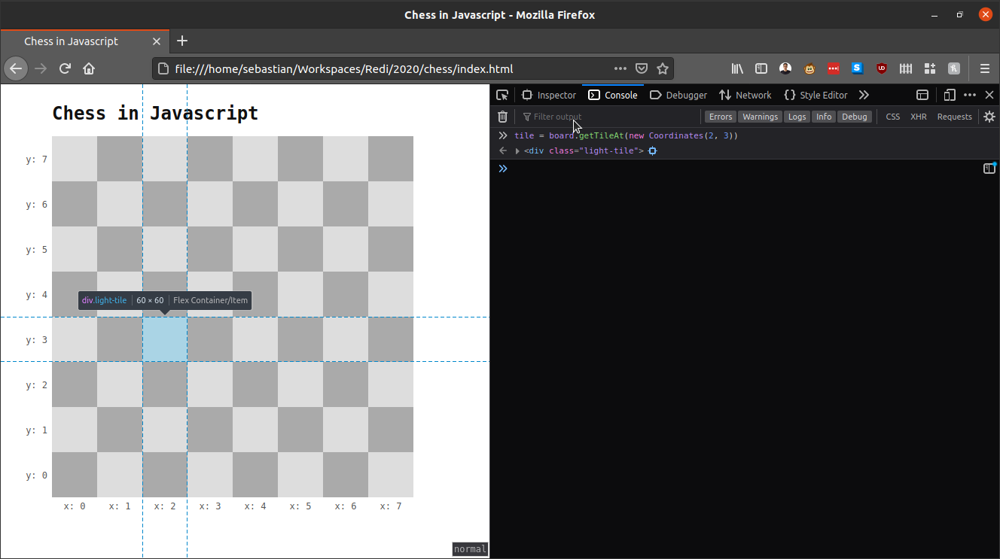

# Chess in Javascript

Try out your prototyping skills using this chessboard! This application serves as a playground for object oriented Javascript programming.

## Usage

### Tiles

You may visit the application in action [here](https://oktupol.github.io/javascript-chess/), or clone / download this repository. Upon visiting the `index.html` page, you will find an empty chess board. In the `index.html`, the board instance is already assigned to the variable `board`.

Open the developer console and type following:
```
tile = board.getTileAt(new Coordinates(2, 3))
```
It will return you a `div` element. Hover above the return value to confirm that this is indeed the tile you wanted to see.



### Pieces

Now let's place a piece on the board. The application comes with the `Piece` prototype, a barebone type that represents the basic features of a chess pice. Let's create one.

```
piece = new Piece(symbols.PAWN, colours.BLACK);
```

Now, what happened here? Using the `Piece` constructor, we created an object with the `Piece` prototype. Right now this piece is not yet on the board, therefore we can't see it. Before we place it there, let me explain how the `Piece` constructor works.

The `Piece` constructor takes two arguments. A symbol, which will later be displayed on the chessboard, and a colour. The colour is either `colours.BLACK` or `colours.WHITE` - two values that come with the application. The symbol may be one of three things:

- A pre-defined chess symbol. This application comes with `symbols.PAWN`, `symbols.ROOK`, `symbols.KNIGHT`, `symbols.BISHOP`, `symbols.QUEEN`, `symbols.KING`. These are going to be automatically translated into Unicode chess-piece symbols.
- An object with the keys `[colour.BLACK]` and `[colour.WHITE]`, each key containing a string value. In this case, different strings will be shown on the board depending whether the piece is black or white
- A string. In this case, the string will be used for display.

Let's create a few more pieces:
```
piece2 = new Piece(symbols.KING, colours.BLACK);
piece3 = new Piece({
    [colours.BLACK]: 'B',
    [colours.WHITE]: 'W'
}, colours.WHITE);
piece4 = new Piece('S', colours.WHITE);
```

And now we're going to place them on the board
```
tile1 = board.getTileAt(new Coordinates(0, 7));
tile1.piece = piece;

tile2 = board.getTileAt(new Coordinates(0, 6));
tile2.piece = piece2;

tile3 = board.getTileAt(new Coordinates(0, 5));
tile3.piece = piece3;

tile4 = board.getTileAt(new Coordinates(0, 4));
tile4.piece = piece4;
```

